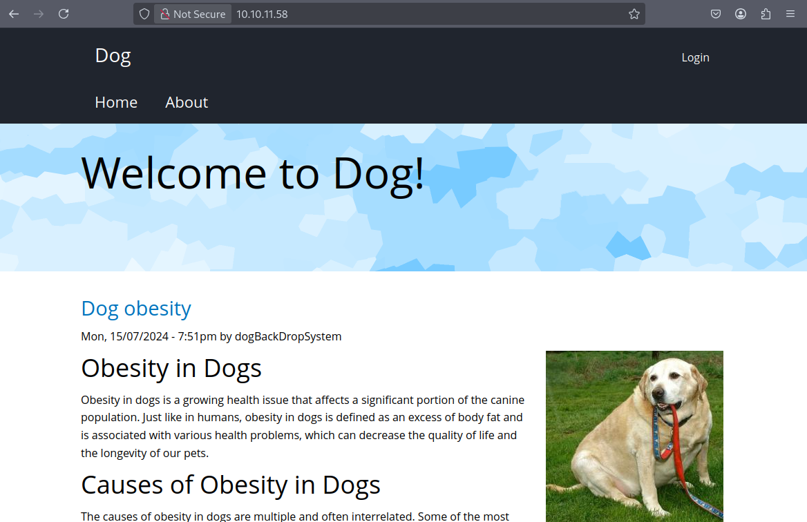

# Dog

## Enumeration

`nmap` finds two open TCP ports, SSH (22) and HTTP (80) :

```bash
 nmap -sC -sV -oA nmap 10.10.11.58
```

```bash
Starting Nmap 7.94SVN ( https://nmap.org ) at 2025-07-11 17:49 CEST
Nmap scan report for 10.10.11.58
Host is up (0.11s latency).
Not shown: 998 closed tcp ports (reset)
PORT   STATE SERVICE VERSION
22/tcp open  ssh     OpenSSH 8.2p1 Ubuntu 4ubuntu0.12 (Ubuntu Linux; protocol 2.0)
| ssh-hostkey: 
|   3072 97:2a:d2:2c:89:8a:d3:ed:4d:ac:00:d2:1e:87:49:a7 (RSA)
|   256 27:7c:3c:eb:0f:26:e9:62:59:0f:0f:b1:38:c9:ae:2b (ECDSA)
|_  256 93:88:47:4c:69:af:72:16:09:4c:ba:77:1e:3b:3b:eb (ED25519)
80/tcp open  http    Apache httpd 2.4.41 ((Ubuntu))
| http-git: 
|   10.10.11.58:80/.git/
|     Git repository found!
|     Repository description: Unnamed repository; edit this file 'description' to name the...
|_    Last commit message: todo: customize url aliases.  reference:https://docs.backdro...
|_http-title: Home | Dog
|_http-generator: Backdrop CMS 1 (https://backdropcms.org)
|_http-server-header: Apache/2.4.41 (Ubuntu)
| http-robots.txt: 22 disallowed entries (15 shown)
| /core/ /profiles/ /README.md /web.config /admin 
| /comment/reply /filter/tips /node/add /search /user/register 
|_/user/password /user/login /user/logout /?q=admin /?q=comment/reply
Service Info: OS: Linux; CPE: cpe:/o:linux:linux_kernel

Service detection performed. Please report any incorrect results at https://nmap.org/submit/ .
Nmap done: 1 IP address (1 host up) scanned in 32.09 seconds

```

The site is a blog talking about Dog Obesity : 

 

